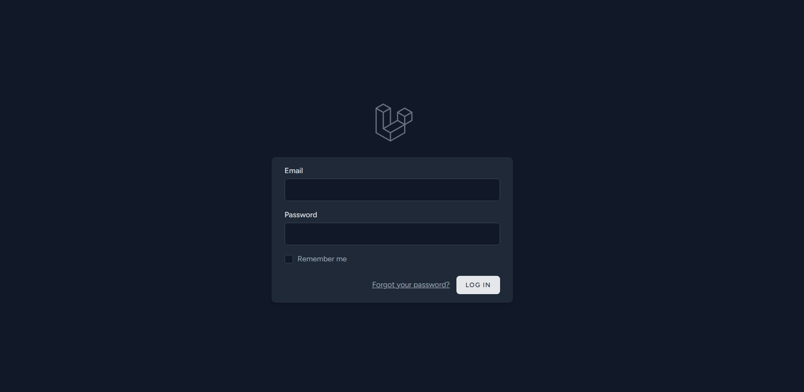
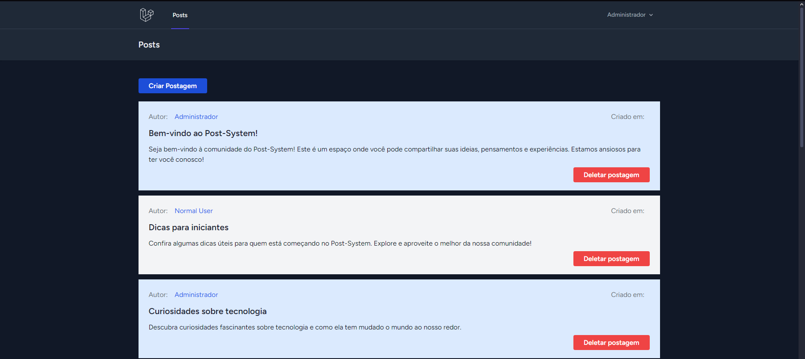

# Blog - System - Um Mini Blog Online

## Descrição

O **Blog - System** foi desenvolvido para simular um blog online utilizando Laravel. Com uma interface intuitiva, ele permite que os usuários criem, editem e organizem suas postagens de maneira eficiente.

Um usuário chamado **Admin** pode manter as regras de boa convivência excluindo posts de outros usuários, enquanto um usuário normal ou visitante não tem acesso a tal função.

## Imagem do Projeto 🌟

<p align="center">
  
</p> 



## Pré-requisitos

Antes de começar, certifique-se de ter os seguintes pré-requisitos instalados em sua máquina:

- **PHP** (versão 7.4 ou superior) - [Download PHP](https://www.php.net/downloads)  
  - Esse projeto foi feito utilizando a versão 8.2.24.
- **Composer** (para gerenciar dependências do PHP) - [Download Composer](https://getcomposer.org/download/)  
  - Não há necessidade de nenhuma alteração na configuração padrão.
- **HeidiSQL** - [Download HeidiSQL](https://www.heidisql.com/download.php)
- **Laragon** (para ambiente local) - [Download Laragon](https://laragon.org/download/)  
  - Não há necessidade de nenhuma alteração na configuração padrão.

## Instalação

Siga os passos abaixo para configurar o projeto em sua máquina local:

1. **Clone o repositório**

   - Abra o terminal e execute:
     ```bash
     git clone https://github.com/Gugaluis/Blog-System.git
     cd blog-system
     ```

2. **Instale as dependências com Composer**

   - Execute o seguinte comando na pasta do projeto:
     ```bash
     composer install
     ```

3. **Crie o banco de dados**

   - Use o HeidiSQL para criar um banco de dados com o nome que desejar e guarde esse nome para que possa ser reutilizado em `DB_DATABASE`.

4. **Configuração do Ambiente**

   - Renomeie o arquivo `.env.example` para `.env`:
     ```bash
     cp .env.example .env
     ```
   - Abra o arquivo `.env` e configure as informações do banco de dados, como:
     ```env
     DB_CONNECTION=mysql
     DB_HOST=127.0.0.1
     DB_PORT=3306
     DB_DATABASE=nome_do_banco (Por padrão utilizei blog-system)
     DB_USERNAME=seu_usuario
     DB_PASSWORD=sua_senha
     ```

5. **Gere a chave de aplicativo**

   - Execute o comando a seguir para gerar uma chave única para o aplicativo:
     ```bash
     php artisan key:generate
     ```

6. **Executar as migrações**

   - Para criar as tabelas necessárias no banco de dados, execute:
     ```bash
     php artisan migrate
     ```

7. **Execute as seeds**

   - Para criar os dados pré-definidos (usuários, senhas e postagens padrão) no banco de dados, execute:
     ```bash
     php artisan db:seed --class=UsersTableSeeder
     php artisan db:seed --class=PostsTableSeeder
     ```

8. **Inicie o servidor**

   - Você pode iniciar o servidor integrado do Laravel com o seguinte comando:
     ```bash
     php artisan serve
     ```
   - O aplicativo estará disponível em `http://localhost:8000`.

## Utilização

1. **Acessando o Aplicativo**

   - Abra o navegador e vá para `http://localhost:8000`.

2. **Login**

   - Para logar na aplicação você pode usar um dos três usuários já criados:

     - **admin@gmail.com** (Administrador)
     - **normal@gmail.com** (Usuário Normal)
     - **visitante@gmail.com** (Visitante)

   - Todos os usuários possuem uma senha padrão: **Aa123456**

3. **Criando Posts**

   - Após o login, você verá a interface principal.
   - Caso tenha feito login como `admin@gmail.com` ou `normal@gmail.com`, você poderá clicar em "Criar postagem" e preencher o título e o conteúdo da postagem.
   - Depois, basta clicar em "Salvar".

4. **Excluindo Postagens**

   - Para excluir, clique no botão **Deletar Postagem**.
   - **Permissões:**
     - **Administrador (`admin@gmail.com`)**: Pode excluir postagens de qualquer usuário.
     - **Usuário Normal (`normal@gmail.com`)**: Pode excluir apenas as próprias postagens.
     - **Usuário Visitante (`visitante@gmail.com`)**: Pode apenas visualizar as postagens de outros usuários.

## Contribuição

Se você deseja contribuir para o projeto, sinta-se à vontade para abrir uma issue ou enviar um pull request.
